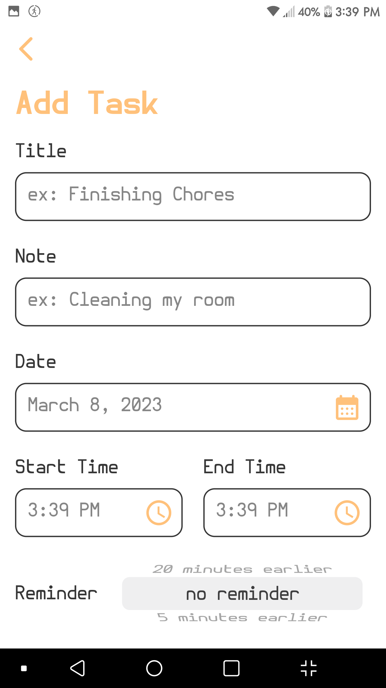

## This is a **Todo App** made with Flutter

- Beautiful colors and widgets
- It supports both light and dark themes
- It has a notification reminder for each task
- Uses Sqlite to save data

 

## Libraries and Packages used:
1- <a href="https://pub.dev/packages/get">get: 4.6.5</a>

2- <a href="https://pub.dev/packages/get_storage">get_storage: 2.0.3</a>

3- <a href="https://pub.dev/packages/intl">intl: 0.17.0</a>

4- <a href="https://pub.dev/packages/sqflite">sqflite: 2.2.4+1</a>

5- <a href="https://pub.dev/packages/date_picker_timeline">date_picker_timeline: 1.2.3</a>

6- <a href="https://pub.dev/packages/flutter_local_notifications">flutter_local_notifications: 13.0.0</a>

7- <a href="https://pub.dev/packages/flutter_native_timezone">flutter_native_timezone: 2.0.0</a>

 

## App Screenshots

| Main Page (Light) | Main Page (dark) | Add Task Page |
| :-: | :-: | :-: |
||

 

---
`Finished on 28-Feb-23`